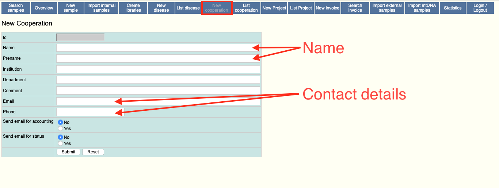
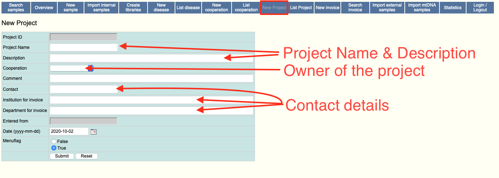

# Projects and Cooperations

Projects and Cooperations serve as attribution mechanisms to rellate groups
of samples and therefore data to individual accounts and apply a basic set
of user permissions.

!!! warning "Important"
    It is mandatory to have at least one project and cooperation available
    prior to first sample upload.

By default, the system does not have any cooperations or projects setup.
They can be setup through use of the `New cooperation` and `New Project` forms respectively.

Normally, a cooperation refers to a human being that is collaborating with the
owner of the EVAdb instance by sending data in for example. Other uses include
setting this to be the absolute owner of the data (in real world terms).

A project is owned by a cooperation. As such a project is used to identify
sets of samples in a logical relation to each other. Access control may be
defined for each project as well as a cooperation. This means that the
administrator can restrict access to samples even within users having access
to the overarching cooperation.

???+ tip "Naming Projects"
    It is recommended to name your projects in upper case with words
    seperated by underscores (`_`). This way, forms and fields in the
    user application will remain more readable even for bigger cohorts.

## New Cooperation Form

{ :loading=lazy }

## New Project Form

{ :loading=lazy }