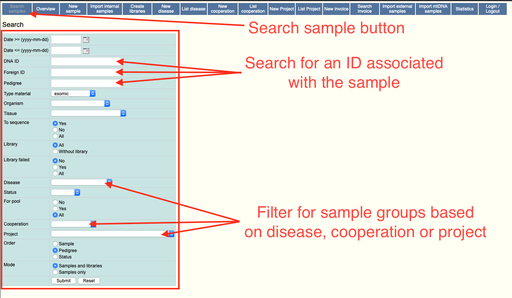
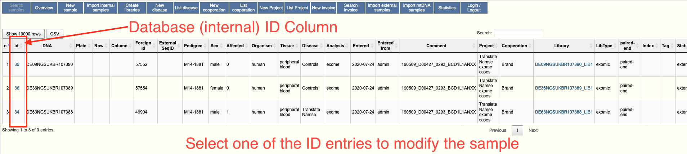
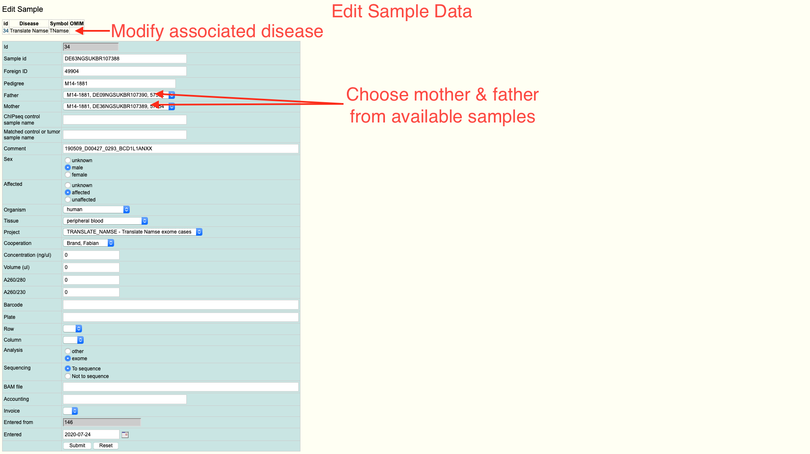

# Sample Management

Samples are central to every analysis. For every query, a sample needs to be
submitted which is used to filter the variants. All SNV's are associated with
one or more sample. A family is denoted by a pedigree id. Filling out sample
and pedigree information is prerequisite to the other data upload scripts and
can be achieved using a pre-formatted sample sheet.

!!! tldr "Sample Management"
    To add new samples to the system, please follow the following procedure:

    1. Create a sample sheet ([Example](https://github.com/mri-ihg/EVAdb/blob/master/samplesheets/IHG_External_Sample_Template_v2018.11.csv))
    2. Upload the sample sheet through "Import External Data"
    3. Add family information for each sample

## Sample Sheets

A sample sheet can be created as a basic comma separated file. The following
columns are mandatory.

| Column | Description |
| :--- | :--- |
| Sample ID | Unique sample identifier |
| Foreign ID | Secondary sample identifier (f.e. external IDs) |
| Pedigree | Family id denoting members of one family |
| Comment | Arbitrary comment |
| Sex | Sex of the patient ("male" or "female") |
| Affected | Affectedness (0/1) |
| Organism | Sequenced organism |
| Tissue | Tissue that was sequenced (peripheral blood etc.) |
| Disease | A name of a disease (must exist in the database) |
| Library Type | Sequencing library type |
| Read Type | Library sequencing protocol type |
| Exome Assay | Exome capture kit used for sequencing |

### Example Sample Sheet

#### Table

|Sample ID|Foreign ID|Pedigree|Comment|Sex|Affected|Organism|Tissue|Disease|Library Type|Read Type|Exome Assay|
|:---|:---|:---|:---|:---|:---|:---|:---|:---|:---|:---|:---|
|76436|76436|B20-0498|TranslateNamse|female|1|human|peripheral blood|Cases|exomic|paired-end|SureSelect60Mbv6|
|76443|76443|B20-0498|TranslateNamse|male|0|human|peripheral blood|Controls|exomic|paired-end|SureSelect60Mbv6|
|76442|76442|B20-0498|TranslateNamse|female|0|human|peripheral blood|Controls|exomic|paired-end|SureSelect60Mbv6|

#### .csv File

``` table
--8<-- "files/example.evadb.csv"
```

## Entering Family Information

While the pedigree ID for each sample can be specified in the sample sheet,
the precise family structure can not. For this it is necessary to go through
the manual process using the UI. To add family information to a sample, you
have to use the admin application.

In the admin application, use the following procedure to add the pedigree
information (i.e. father/mother).

1. Find the sample using `Search samples`
{: loading=lazy }
2. Click on the `Id` column of the sample you want to modify
{: loading=lazy }
3. Enter `mother` and `father` in the corresponding rows
{: loading=lazy }
