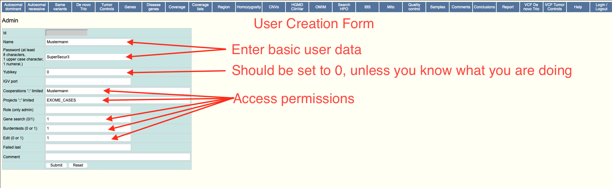

# User Management

For EVAdb there are multiple types of users. Some users, such as the database
users for both applications are fixed. Other users can be created dynamically,
through the web user interface, to allow people to logon to the software.

## Database Users

The most primitive user type is the database user. In simple terms, this is
the user that is used by the perl backend to retrieve data and send data to
and from the mariadb service. Under normal operation, these users should not
be touched and provided to the applications once at startup.

!!! hint "Security"
    For additional security, it is possible to give differernt user permissions
    to the respective applications. For the user application, a mostly
    read-only mysql user is enough. The admin application however requires
    write permissions to most tables.

For the docker version of EVAdb, these users are set through the `MYSQL_*`
`.env` settings. If using the bare-metal installation, supply a secrets file
containing the information.

``` text
dblogin:<USER>
dbpasswd:<PASSWORD>
```

## Web Users

To be able to login to the application, each user must have a user account
created. The initial administrator account will be created on first start, if
the docker version is used. To re-create this account, set `INIT_USER="1"`.
This account has administration privilige, meaning you are able to create new
accounts within the system. It is also able to login to both, the admin and
user systems. When using a bare-metal installation this user needs to be
created through the use of mysql.

``` sql
# After logging in to your mysql/mariadb instance
# Please change the password
INSERT INTO exomevcfe.user
(name,password,role,edit,genesearch,yubikey)
VALUES 
('admin','$2a$08$pmAbhhM2wYD/G9oxziYV3.J9MHwOTG2edQP.RXX.YF2HAhWJ0L1Jm','admin',1,1,0);
```

Aside from the initial user, all other users can be created through the
use of the web interface. Thee form will allow for the following values to
be passed.

| Field | Example | Description |
| :--- | :---: | :--- |
| Name | brand | Username |
| Password | Abcd1234 | Password |
| Yubikey | 0 | _Can_ be set to the yubikey id for two-factor authentication. If you have not enabled yubikey authentication on your system this **must** be set to `0`. |
| IGV port | 10151 | Port to manage IGV |
| Cooperations | coop1::coop2 | List of cooperations this account has access to. If empty, access to all is allowed. |
| Projects | proj1::proj2 | List of projects the account has access to. If empty, access to all is allowed. |
| Role | admin | Can be `admin` or empty. Sets the user as an admin if desired. |
| Gene search | 0 | Allow user to use gene search features. |
| Burdentests | 0 | Allow user to use burdentest analysis. |
| Edit | 1 | Allow user access to the admin application. |
| Failed last | | |
| Comment | Legible Information | Arbitrary comment |

### User Creation

To create a new user for your EVAdb Frontend, please follow these steps.

1. Choose "New account" from the top menu (right-most option)
2. Enter Account Information
{ :loading=lazy }